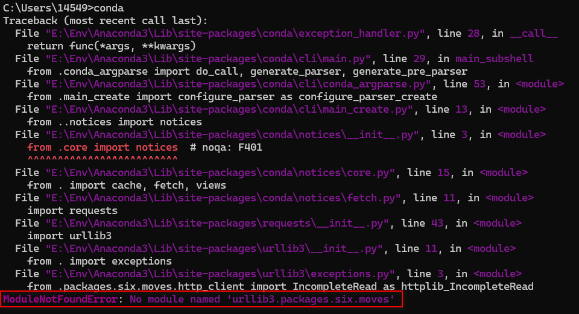
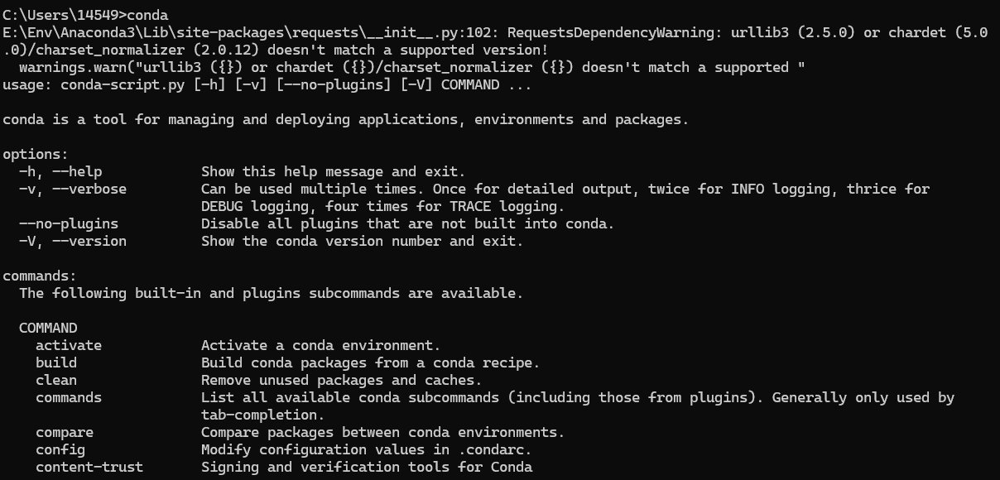

## 报错提示

在启动==conda==时报错：`ModuleNotFoundError: No module named 'urllib3.packages.six.moves'`



## 解决方法

参照网上方法执行下面指令：

```powershell
pip3 uninstall urllib3 -y --cert root.pem

pip3 install --no-cache-dir -U urllib3
```

成功启动conda，但是存在告警。



```powershell title="报错"
ERROR: pip's dependency resolver does not currently take into account all the packages that are installed. This behaviour is the source of the following dependency conflicts.
conda-repo-cli 1.0.165 requires PyYAML>=6.0.1, but you have pyyaml 5.3.1 which is incompatible.
conda-repo-cli 1.0.165 requires requests>=2.31.0, but you have requests 2.27.1 which is incompatible.
distributed 2025.2.0 requires pyyaml>=5.4.1, but you have pyyaml 5.3.1 which is incompatible.
pyppeteer 2.0.0 requires urllib3<2.0.0,>=1.25.8, but you have urllib3 2.5.0 which is incompatible.
requests 2.27.1 requires urllib3<1.27,>=1.21.1, but you have urllib3 2.5.0 which is incompatible.
sphinx 8.2.3 requires colorama>=0.4.6; sys_platform == "win32", but you have colorama 0.4.4 which is incompatible.
sphinx 8.2.3 requires requests>=2.30.0, but you have requests 2.27.1 which is incompatible.
streamlit 1.45.1 requires tenacity<10,>=8.1.0, but you have tenacity 8.0.1 which is incompatible.
```

