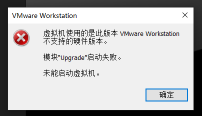
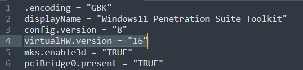

## 报错提示

在VMware打开虚拟机的时候，经常会遇到如下的提示：

## 解决方法

打开此虚拟机所在的文件夹，找到`.vmx`后缀的配置文件，以文本形式打开，并找到选项`virtuaIHW.version`对应的那一行，将后面的数字改为你安装的VMware对应的版本。

例如我这里报错的原因是我安装的Vmware版本是16，但是虚拟机配置文件中`virtuaIHW.version=21`，将其改为16后，可以正常打开。

