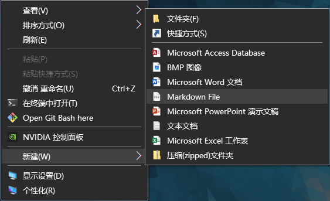
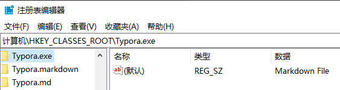
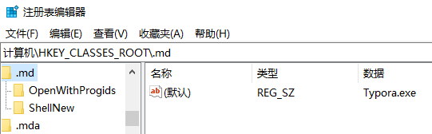
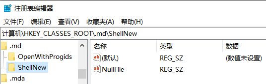

使用Typora进行写作时，右键新建菜单里面能直接新建md文件是非常有必要的。效果如下图：




## 前提条件

电脑中必须安装==Typora==。

## 操作步骤

### 新建注册表文件

在电脑任意地方新建文件`md.reg`，写入以下内容：

```shell title=md.reg
Windows Registry Editor Version 5.00
[HKEY_CLASSES_ROOT\.md]
@="Typora.exe"
[HKEY_CLASSES_ROOT\.md\ShellNew]
"NullFile"=""
[HKEY_CLASSES_ROOT\Typora.exe]
@="Markdown File"
```

### 导入注册表项

双击刚才保存的 `md.reg` 文件，系统会提示你是否允许修改注册表，点击`是`以确认。

### 重启电脑（可选）

部分系统可能需要重启后变更才能生效。重启后，右键点击桌面或任意文件夹空白处，选择“新建”，即可看到 “Markdown File” 选项，点击即可新建 `.md` 文件。

### 查看注册表

以上的操作也可以在注册表中直接操作。`Win+R`输入`regedit`打开注册表，找到路径`计算机\HKEY_CLASSES_ROOT\Typora.exe`，并添加内容如下：



找到路径`计算机\HKEY_CLASSES_ROOT\.md`，并确保内容如下：



`.md`目录下新建`ShellNew`文件，内容如下：

