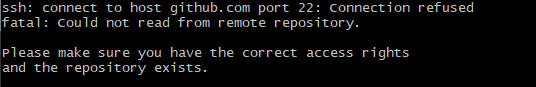
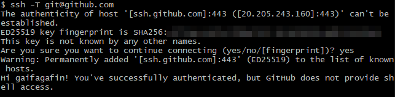
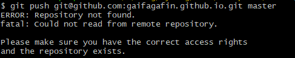

## 使用GitHub Actions部署

```yml
name: Deploy VuePress site to Pages

on:
  # 在推送到 main 分支时触发
  push:
    branches: [main]
  # 允许手动触发
  workflow_dispatch:

# 设置 GITHUB_TOKEN 的权限以允许部署到 GitHub Pages
permissions:
  contents: read
  pages: write
  id-token: write

# 只允许同时进行一次部署，跳过正在运行和最新队列之间的运行队列
concurrency:
  group: pages
  cancel-in-progress: false

jobs:
  # 构建工作
  build:
    runs-on: ubuntu-latest
    steps:
      - name: Checkout
        uses: actions/checkout@v4
        with:
          fetch-depth: 0 # 如果未启用 lastUpdated，则不需要
      
      - name: Setup Node.js
        uses: actions/setup-node@v4
        with:
          node-version: 20
          cache: npm
      
      - name: Install dependencies
        run: npm ci
      
      - name: Build with VuePress
        run: npm run docs:build
      
      - name: Create CNAME file
        run: echo 'gaifagafin.top' > docs/.vuepress/dist/CNAME
      
      - name: Setup Pages
        uses: actions/configure-pages@v4
      
      - name: Upload artifact
        uses: actions/upload-pages-artifact@v3
        with:
          path: docs/.vuepress/dist

  # 部署工作
  deploy:
    environment:
      name: github-pages
      url: ${{ steps.deployment.outputs.page_url }}
    needs: build
    runs-on: ubuntu-latest
    name: Deploy
    steps:
      - name: Deploy to GitHub Pages
        id: deployment
        uses: actions/deploy-pages@v4
```


## 可能遇到的问题

### 无法连接到22端口



**解决方法：**

在本地的`~/.ssh/config`文件中添加以下内容：

```
Host github.com
	Hostname ssh.github.com
	Port 443
```

使用==git-bash==测试`ssh -T git@github.com`，成功连接。



### git推送问题



解决办法：

需要在`docs\.vuepress\dist`目录下执行下面的命令，添加远程仓库。

```bash
git remote add origin git@github.com:gaifagafin/gaifagafin.github.io.git
```

在`docs\.vuepress\dist\.git\config`文件中也能看到新增的内容。

```typescript
[core]
	repositoryformatversion = 0
	filemode = false
	bare = false
	logallrefupdates = true
	symlinks = false
	ignorecase = true
[remote "origin"]
	url = git@github.com:gaifagafin/gaifagafin.github.io.git 	// [!code ++]
	fetch = +refs/heads/*:refs/remotes/origin/*
```
